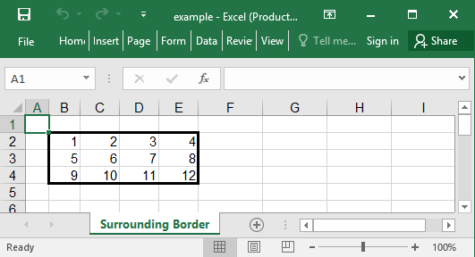

## Description

More programmatic way to set the borders

## Code

```ruby
require 'axlsx'

p = Axlsx::Package.new
wb = p.workbook
s = wb.styles

defaults = { style: :thick, color: '000000' }
borders = Hash.new do |hash, key|
  hash[key] = s.add_style border: defaults.merge({ edges: key.to_s.split('_').map(&:to_sym) })
end

top_row = [0, borders[:top_left], borders[:top], borders[:top], borders[:top_right]]
middle_row = [0, borders[:left], 0, 0, borders[:right]]
bottom_row = [0, borders[:bottom_left], borders[:bottom], borders[:bottom], borders[:bottom_right]]

wb.add_worksheet(name: 'Surrounding Border') do |sheet|
  sheet.add_row []
  sheet.add_row ['', 1, 2, 3, 4], style: top_row
  sheet.add_row ['', 5, 6, 7, 8], style: middle_row
  sheet.add_row ['', 9, 10, 11, 12]

  #This works too!
  sheet.rows.last.style = bottom_row
end

p.serialize 'example.xlsx'
```

## Output


