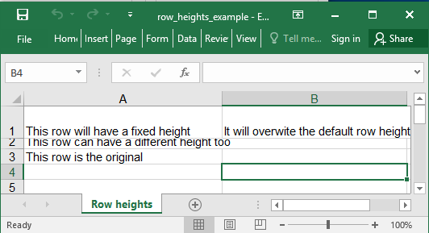

## Description

You can set the row heights

## Code

```ruby
require 'axlsx'

p = Axlsx::Package.new
wb = p.workbook

wb.add_worksheet(name: 'Row heights') do |sheet|
  sheet.add_row ['This row will have a fixed height', 'It will overwite the default row height'], height: 30
  sheet.add_row ['This row can have a different height too'], height: 10
  sheet.add_row ['This row is the original']
end

p.serialize 'row_heights_example.xlsx'
```

## Output


